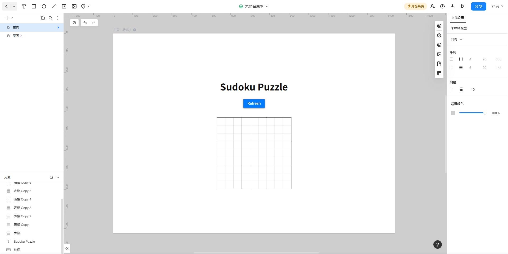

`
# 2023秋软工实践 第一次结对编程作业

| 这个作业属于哪个课程  |                   [班级链接](https://bbs.csdn.net/forums/fzusdn-0831?typeId=4994744)                   |
|:-----------:|:--------------------------------------------------------------------------------------------------:|
|  这个作业要求在哪里  |                           [作业链接](https://bbs.csdn.net/topics/617255492)                            |
|    个人学号     |                                             112100821                                              |
|   结对成员学号    |                                             102101325                                              |
| GitHub 仓库地址 |                         [GitHub仓库](https://github.com/Andy-boy123/sudoku)                          |

# 作业要求

## 背景
jason哥最近迷上了九宫格数独，所谓九宫格数独是把一个9x9的网格从左到右从上到下依次划分出9个3x3的子网格，每个3x3的子网格称为一宫，共划分成9宫。
而9宫数独是在网格的格子上填上1到9的数字，要求每一行每一列和每一宫都刚好填上1到9的数字不重复不遗漏，每一个九宫格数独如图所示：


对于聪明的jason哥来说，只做一个九宫格数独实在是太简单了，她可以同时完成9个九宫格的数独求解，但每次玩数独游戏时，每一个九宫格数独都是串行生成的，暴躁的jason哥不愿意等待串行生成的时间，于是需要你并发生成9个九宫格数独，
注意本次作业只需要并发生成9个数独，而不是求解，但注意所生成数独的可解性，具体的求解交给聪明的jason哥就可以啦。

## 实现要求
请完成一个“9个九宫格数独生成”网页端或APP的开发。实现路线：需求分析 -> 原型绘制 -> 代码实现

- 进行需求分析。文字准确、样式清晰、图文并茂。字数在500字左右。文字是对图片的补充，只给出文字，而没有图片，对用户而言是不友好的。

- 原型模型必须采用专用的原型模型设计工具实现：如Axure、Rapid、Balsamiq Mockups、Prototype、Composer、GUI Design Studio、Adobe设计组件、墨刀等等。在博文中说明你所采用的原型开发工具，并给出你的原型展示在线链接，例如墨刀原型链接。

- 原型界面呈现的流程应该逻辑清晰，用户易懂易用，符合主流人群的使用习惯。如何定义易懂易用？如果是老师、助教或者其他角色作为用户，则以该用户的使用反馈为标准，无论如何，以用户的使用体验作为他或者她的评分标准。

- 设计美观。UI设计规范统一，美观精致。好看这一词同样很笼统，参考上面的第3条标准，以实际用户的使用体验为准。

- 代码实现。实现相关的功能，9个九宫格数独的并发生成，特别注意，必须使用并发技术生成9个数独，而不是串行生成。你可能需要学习多线程或多进程、并发数据结构、调优和性能测试等技术，将实现的代码上传至GitHub，并在上传代码的仓库的README.md中写清楚运行代码的方法，方便助教检查。

## 编码要求

- 制定合适的代码规范，进行测试。

- 使用 git 进行版本控制，两个人要通过 git 协作方式完成编码。两个都要有代码编写和相应的单元测试。

## 博客要求
- 结对的**两名同学都需要提交作业**，两名同学的博客主体内容可以保持一致，按照个人不同感受自行调整博客表述和内容次序。

- 基础格式要求

- 标记结对两个人的学号姓名信息（结对作业只需要一个人提交即可）。

- 对客户需求进行**需求分析** ，可采用**NABCD**模型。

- 记录本次作业的**PSP表格**，包括预估耗时和实际耗时。

- 给出所采用的原型开发工具，并给出你的原型展示**在线链接**。

- 详细写出运用的算法和技术，包括**并发性算法**和**数独随机生成可解性保证**等。

- 实现代码的**GitHub链接**，注意仓库要设置为公开，方便助教检查。

- **给出照片若干张**，包括纸画原型、结对的同学、工作地点、计算机等，可选项包括其他能表达结对编程工作经历的物品或场景。

- 总结本次作业，遇到的难点以及如何解决、第一次结对编程的体验等等，两位同学分别总结。

# 项目结构

    .
    ├── README.md
    ├── app.py
    ├── sudoku_generator.py
    ├── static
    │   ├── style.css
    ├── img
    └── templates
        └── index.html

# 项目部署

使用python flask框架进行项目编程，在完成项目编程之后，将项目文件打包上传至服务器，
在服务器使用命令行运行app.py文件，即可在服务器上部署该项目。

> **[在线预览](http://sudoku.andylive.cn/)**

# 应用需求分析

### 背景

在数独游戏中，九宫格数独是一项富有挑战性和乐趣的谜题，要求在一个9x9的网格上填入数字1到9，使得每行、每列和每个3x3的子宫格中都包含1到9的数字，且数字不重复。在这个背景下，Jason哥是一位热衷于数独的玩家，但对于他来说，仅仅解决一个九宫格数独太过容易，他渴望挑战更多，因此需要一款并发生成多个九宫格数独的应用，以提高游戏难度和娱乐性。

### 需求分析

#### NABCD模型

##### Need（需求）
把一个9x9的网格从左到右从上到下依次划分出9个3x3的子网格，每个3x3的子网格称为一宫，共划分成9宫。
而9宫数独是在网格的格子上填上1到9的数字，要求每一行每一列和每一宫都刚好填上1到9的数字不重复不遗漏，每一个九宫格数独如图所示：


##### Approach（方法）
使用并发技术生成9个九宫格数独，而不是串行生成，保证所生成数独的可解性。

##### Benefit（好处）
提高游戏难度和娱乐性，锻炼玩家思维，减少玩家等待时间。

##### Competitors（竞争）
目前市面上的数独游戏大多数都是串行生成数独，而不是并发生成数独，因此本应用具有一定的竞争优势。

##### Delivery（交付）
本应用将在网页端上实现，用户可以通过浏览器或手机进行访问，同时可以进行刷新操作，以生成新的数独。


# PSP表格
|           Personal Software Process Stages            |   预估耗时（分钟）   |  实际耗时（分钟）  |
|:-----------------------------------------------------:|:------------:|:----------:|
|                     Planning（计划）                      |      45      |     30     |
|                    Estimate（估计时间）                     |     120      |    180     |
|                    Development（开发）                    |     180      |    240     |
|                Analysis（需求分析（包括学习新技术）                 |      60      |     80     |
|                     Design（具体设计）                      |     100      |    120     |
|                     Coding（具体编码）                      |     360      |    400     |
|                Test（测试（自我测试，修改代码，提交修改）                |     240      |    260     |
| Postmortem & Process Improvement Plan（事后总结，并提出过程改进计划） |      45      |     45     |
|                       Total（合计）                       |     1150     |    1355    |


# 原型设计

>原型模型设计工具：[墨刀](https://modao.cc/app/qYKD7JWKs11c1mjNNUPZw0)



# 运用技术与方法

## 并发性算法
该项目采用了线程（threading）来实现并发性。在 app.py 中使用了 threading.Lock() 来创建了一个线程锁 sudoku_lock
，以确保在多线程环境下生成数独时不会出现竞争条件。
具体来说，在 /generate_sudoku 路由处理函数中：

```python
@app.route('/generate_sudoku')
def get_sudoku():
    # 使用锁以确保多个线程不会同时生成数独
    with sudoku_lock:  
    # with sudoku_lock:: 这是一个 Python 上下文管理器 (with 语句)，它会自动获取锁并在代码块结束时释放锁。这确保了在进入临界区之前获取了锁，且在离开临界区时释放了锁。
    # sudoku_lock: 这是在全局范围内创建的一个线程锁对象，通过 threading.Lock() 创建。锁用于在多线程环境中防止多个线程同时访问临界区（这里是生成数独）。
        sudoku_data = generate_sudoku()  # 在获取了锁之后，调用了 generate_sudoku() 来生成数独。
    return jsonify(sudoku_data)     # 返回生成的数独数据。
```

## 数独随机生成可解性保证
在 sudoku_generator.py 文件中，首先创建一个空的数独谜题，
然后使用回溯算法来解决它。随后，通过随机挖洞的方式生成具有可解性的数独谜题。

```python
# sudoku_generator.py

# ...

def generate_sudoku():
    # 创建一个9x9的空数独谜题
    board = [[0 for _ in range(9)] for _ in range(9)]

    # 使用回溯算法解决空数独谜题
    solve_sudoku(board)

    # 随机挖洞，生成题目
    num_holes = random.randint(40, 60)  # 谜题难度可以根据挖洞数量调整
    for _ in range(num_holes):          # 循环根据随机生成的数量来挖洞
        row, col = random.randint(0, 8), random.randint(0, 8)  # 随机选择一个行和列为挖洞位置
        while board[row][col] == 0:     #  确保所选的位置不是已经挖过的洞。
            row, col = random.randint(0, 8), random.randint(0, 8)
        board[row][col] = 0             # 将选定的位置设为零，表示挖洞

    return board
```

# GitHub仓库地址

> [GitHub仓库](https://github.com/Andy-boy123/sudoku)

# 照片


# 总结

## 112100821陈力恒 总结

通过这次项目编程，我学习到了很多新的知识，比如并发性算法、数独随机生成可解性保证等等。在这次项目编程中，
我主要负责了项目的前端设计和后端编程，通过这次项目编程，我对前端和后端的编程有了更深的了解，
同时也对并发性算法和数独随机生成可解性保证有了更深的了解。在这次项目编程中，我遇到了很多困难，
比如如何使用并发性算法来生成数独，如何保证生成的数独有可解性等等，但是通过查阅资料和和同伴的帮助，
我最终解决了这些困难。通过这次项目编程， 我对并发性算法和数独随机生成可解性保证有了更深的了解， 这次项目编程让我受益匪浅。

## 102101325陈佳城 总结
